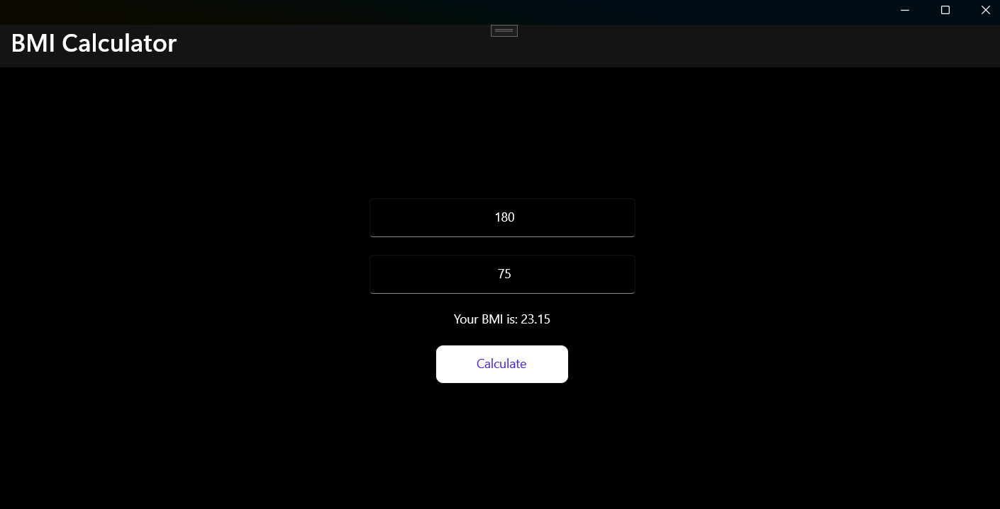
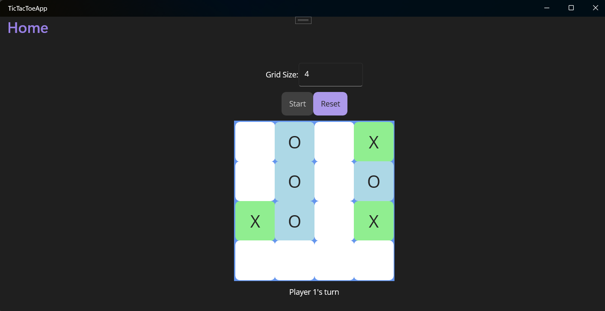
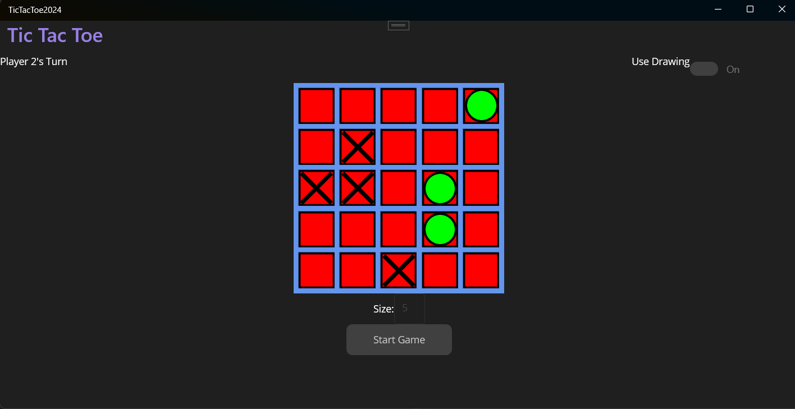
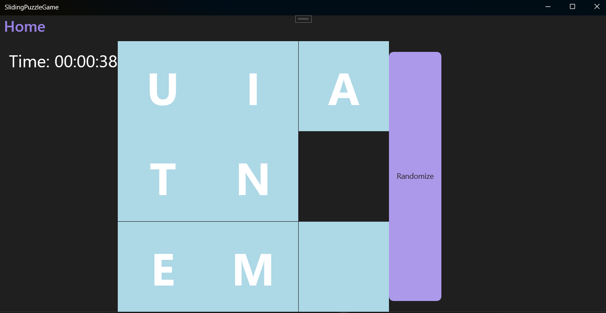
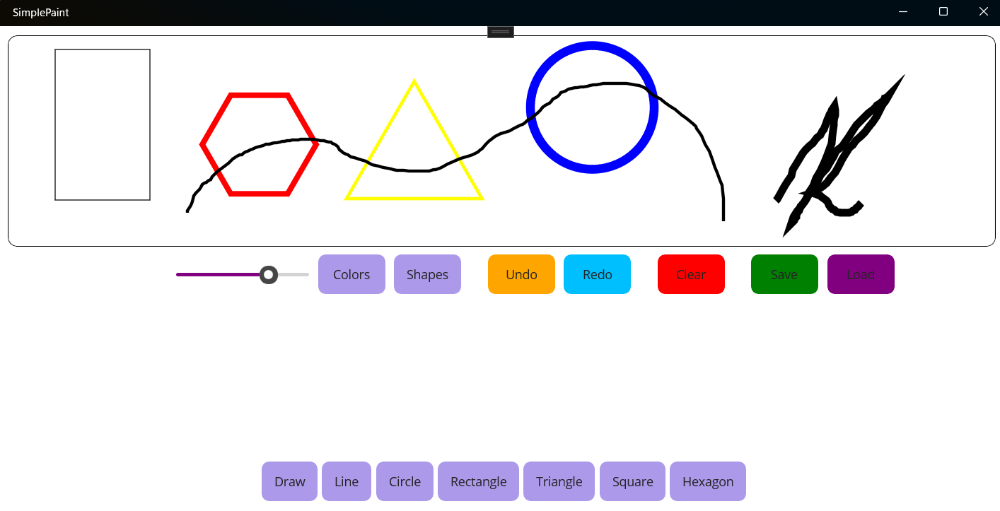
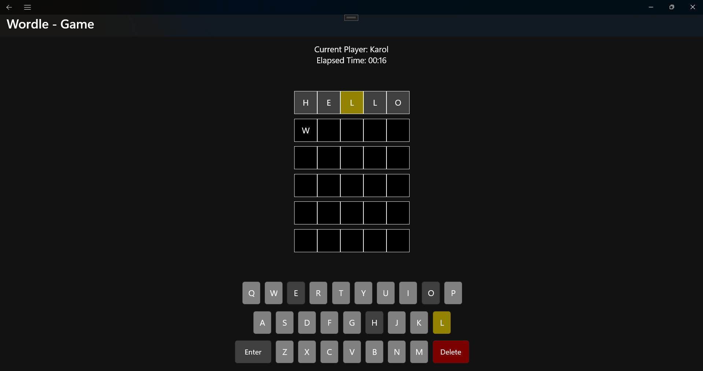

# 📱 .NET MAUI Coursework Projects - ATU Galway City

[](https://dotnet.microsoft.com/)
[](https://visualstudio.microsoft.com/)
[](https://learn.microsoft.com/dotnet/maui/)

This repository contains a collection of cross-platform mobile and desktop applications developed during my **2nd year of studies at ATU Galway City**.

The apps were built with **.NET MAUI**, starting from simple exercises and evolving into more advanced projects.
This includes a **midterm (SimplePaint)** and a **final project (WordleApp)**.

---

## 📑 Table of Contents

* [📂 Project Structure](#-project-structure)
* [🛠 System Requirements](#-system-requirements)
* [✅ Tested Environment](#-tested-environment)
* [⚙️ Setup Instructions](#️-setup-instructions)
* [📜 License](#-license)
* [🙏 Acknowledgments](#-acknowledgments)

---

## 📂 Project Structure

This repository contains **one Visual Studio solution** with six independent projects:

### 1️⃣ BmiCalculator

A simple BMI calculator for input handling and UI binding.



---

### 2️⃣ TicTacToeApp

Classic Tic-Tac-Toe with win condition logic.



---

### 3️⃣ TicTacToeAlternate

Alternate Tic-Tac-Toe implementation with a different approach.



---

### 4️⃣ SlidingPuzzleGame

Sliding tile puzzle focusing on state management and interactivity.



---

### 5️⃣ SimplePaint (Midterm Project)

A basic paint/drawing app with touch & mouse input.



---

### 6️⃣ WordleApp (Final Project)

A Wordle-inspired game combining UI design and game logic.



---

## 🛠 System Requirements

To run these projects, you’ll need:

* **OS:** Windows 10/11 (recommended) or macOS (for iOS builds)
* **IDE:** [Visual Studio 2022](https://visualstudio.microsoft.com/) with **.NET MAUI workload**
* **.NET SDK:** Version **9.0** (originally .NET 7.0)
* **Optional:** Android Emulator / iOS Simulator / physical device

---

## ✅ Tested Environment

* **IDE:** Visual Studio 2022 (latest updates)
* **.NET Versions:** Built with 7.0 -> upgraded to **9.0**
* **Platforms:** Windows (desktop), Android Emulator

---

## ⚙️ Setup Instructions

1. Clone this repository:

   ```bash
   git clone https://github.com/karoluciecha/dotnet-maui-college-coursework.git
   cd dotnet-maui-college-coursework
   ```
2. Open the solution (`.sln`) in **Visual Studio 2022**.
3. Ensure **.NET MAUI workload** is installed:

   * Visual Studio Installer -> Modify -> Workloads -> .NET Multi-platform App UI development.
4. Set the desired **startup project** (e.g., `BmiCalculator`).
5. Choose a **target platform** (Windows, Android, iOS) and run the app.

---

## 📜 License

This repository is intended for **educational purposes**.
You are welcome to explore, adapt, and learn from the code.

---

## 🙏 Acknowledgments

Thank you for checking out my **.NET MAUI college coursework repository**.
Any feedback or suggestions are always appreciated!
